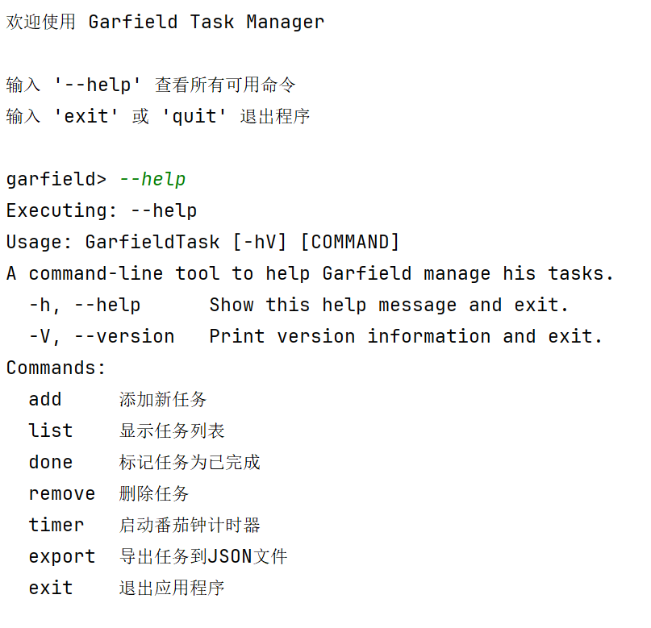
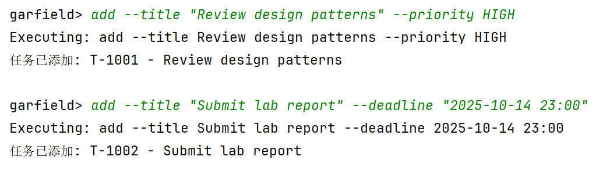
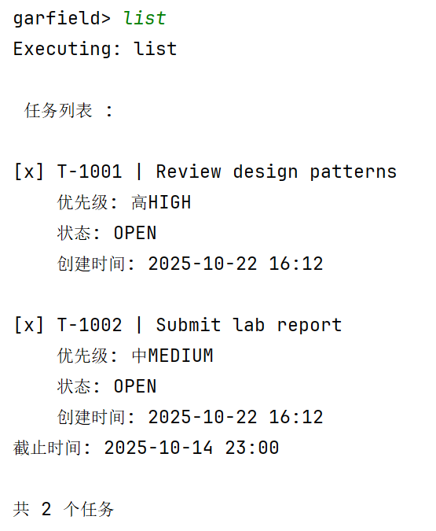
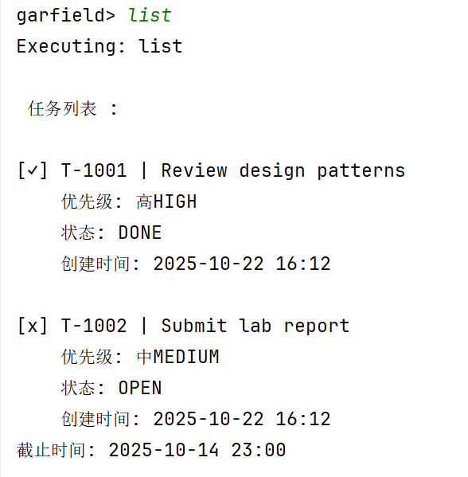
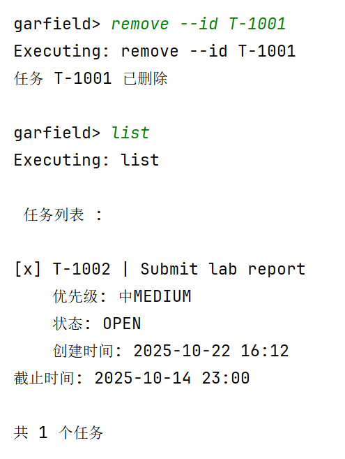
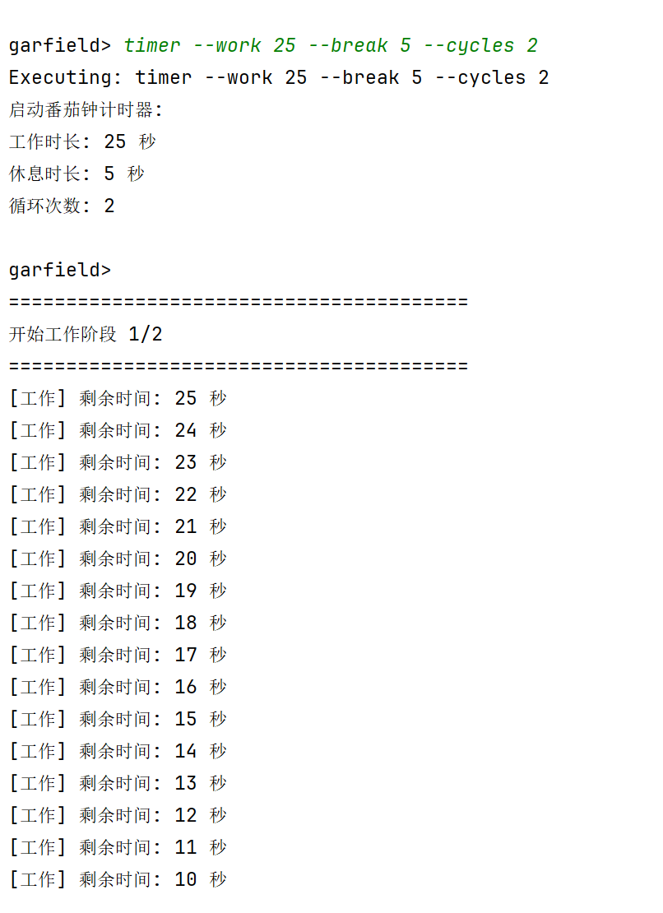
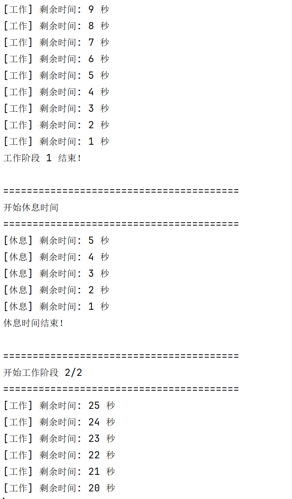
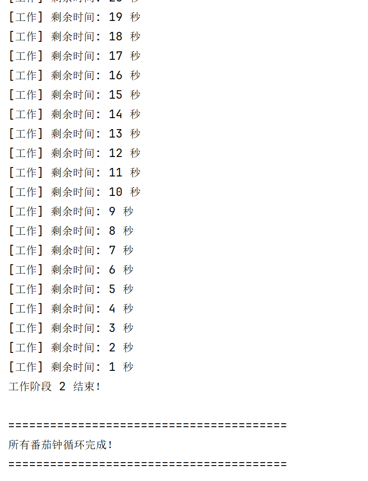
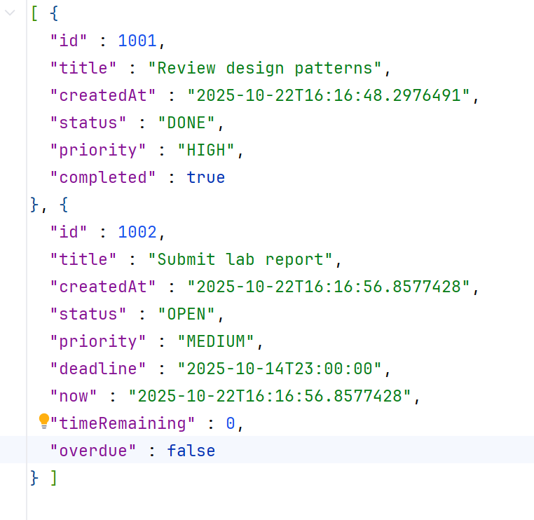
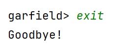

# Garfield Task Manager

## 2354093 李雪菲

### build commands
```
mvn clean
mvn compile
mvn package
```
- 生成jar:GarfieldTask-1.0.0.jar
- 运行jar
```
java -jar target/GarfieldTask-1.0.0.jar
```

### running examples.

1. add: Add a new task. The command should create a DeadlineTask if the --deadline option is
   provided; otherwise, it creates a SimpleTask.
   garfield> add --title "Review design patterns" --priority HIGH
   garfield> add --title "Submit lab report" --deadline "2025-10-14 23:00"

2. list: Display the current tasks. It should support filtering by status or priority.
   garfield> list


3. done: Mark a task as completed.
   garfield> done --id T-1001


4. remove: Delete a task.
   garfield> remove --id T-1001


5. timer: Start the Pomodoro timer following the logic from Section 2 above.
   garfield> timer --work 25 --break 5 --cycles 2



6. export: Save the current session’s tasks to a JSON document following the logic from Section 3.
   garfield> export --file my-tasks.json



7. exit: Exits the application.
   garfield> exit
   Goodbye!
   