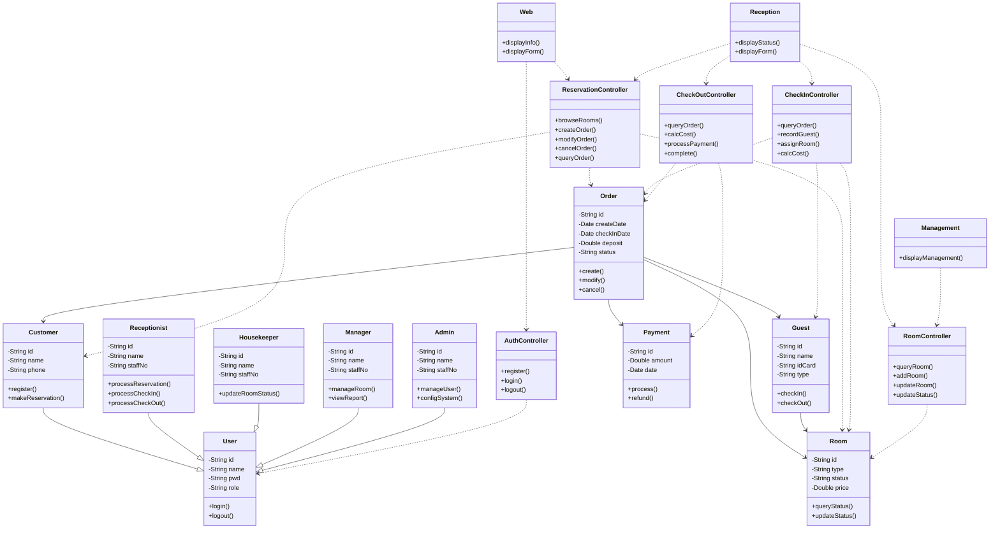

# 宾馆管理信息系统类图（Mermaid格式 - 简化版）

## 类图说明

本简化类图包含核心的三层架构：
- **实体层**：User、Customer、Receptionist、Housekeeper、Manager、Admin、Guest、Room、Order、Payment
- **控制层**：AuthController、ReservationController、CheckInController、CheckOutController、RoomController
- **边界层**：Web、Reception、Management

详细说明请参考 **类图说明文档-简化版.md**

